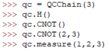
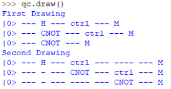
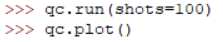
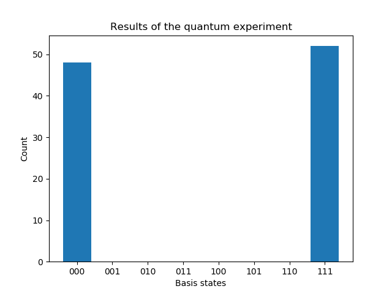

# QCSimulationPackage

This is just a toy project to get familiar with packages and GitHub.

In the QCircuit.py there are two classes: **QCircuit** and **QCChain**:
QCircuit updates the state of the system after every addition of a gate.
QChain keeps track of all gates, and one need to call .simulate to know its state.
*QChain is also more flexible*, one can add and delete gates at any place using .add and .delq.
Finally, QChain has a .run module which permits to launch many simulations, and a .plot option.

Demonstration, the 'Hello, world!' of Quantum Computing: Creating Entangled Triplets.

Notice when adding gates the default is to add them to the first qubit.

We can also draw the circuit:

Finally we can run the simulation a hundred times and plot the results:

Check out the **Wiki** or more information on how to use the gates in the circuit, and to get started in general.

It is not clear whether this toy project will be continued. Maybe one could add higher-level modules to create for example quantum teleportation.
